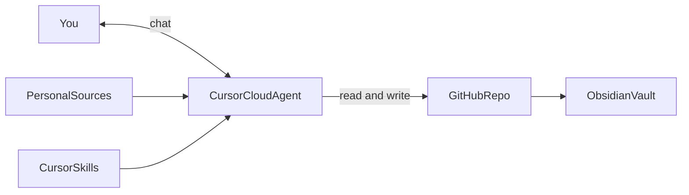

# Brainy

**Personal life-OS research prototype** — personal sources flow into durable storage; an LLM provides grounded access over that graph, not over chat history alone.

> **Status:** early research prototype. Repository layout, workflows, and integrations may change without backward compatibility. This is not a commercial product and does not provide medical or clinical advice.

---

## Idea

Brainy explores a personal second brain where documents, internet context, lab results, nutrition logs, media, manual input, and (later) wearable signals merge into one storage layer. A CORE stack — LLM, skills, agents, cloud runtime, and storage — works over those sources so recall compounds over time instead of vanishing into disposable conversation history.

The point is grounded access to *your* data: searchable history, decisions, and source nodes you can return to — not another chatbot that only remembers the current thread.

This repository is open source so the platform can grow through integrations with external systems. There is no hosted SaaS. You fork the project, connect your own sources, and run the stack yourself.

---

## Current architecture

| Role | Tool |
|------|------|
| Data storage / source of truth | GitHub repository |
| AI orchestrator | Cursor (Cloud Agent connected to the repo) |
| Deterministic workflows | Cursor Skills |
| Repository visualizer | Obsidian (vault over the local clone) |

**How it works today**

1. Your personal data lives in a GitHub repository (the durable graph / source of truth).
2. A **Cursor Cloud Agent** connected to that repository acts as the assistant: it reads and updates the repo with LLM-backed reasoning.
3. **Cursor Skills** encode deterministic workflows so repeated tasks stay consistent.
4. **Obsidian** opens the same repository as a vault for browsing, linking, and graph navigation.

Cursor can be installed on a mobile phone, so the same assistant is available from your pocket — chat with the Cloud Agent against your repo without sitting at a desktop.

Your fork is your Brain. Nothing is shared through a multi-tenant service.

---

## Getting started

Expect the directory layout and skills to evolve as the prototype matures.

1. **Fork** this repository on GitHub.
2. **Clone** your fork locally.
3. **Open the clone in Obsidian** as a vault (root of the repository).
4. **Connect Cursor** to your GitHub repository and enable a Cloud Agent against that repo.
5. **Add your data and skills** as structure lands in the project — personal notes, exports, and deterministic workflows you care about.
6. **Keep secrets out of git.** Do not commit credentials or local-only files; use patterns already covered in [`.gitignore`](.gitignore) (for example `.env`).

---

## Roadmap

Planned directions (subject to change):

- Wearable integrations (sleep, workouts, heart rate) as optional source nodes
- Broader personal-information sources: labs, nutrition, media libraries, internet ingest
- Open integrations with external systems — contributed or personal forks extend the graph

**SaaS is not planned.** Distribution model remains fork, configure, and self-host your own stack.

---

## Contributing

This is a research prototype. Ideas, integrations, and improvements that fit a self-owned personal data graph are welcome via issues and pull requests. Expect breaking changes while the architecture settles.

---

## License

[MIT](LICENSE) © 2026 Kiryl Bahdanovich
